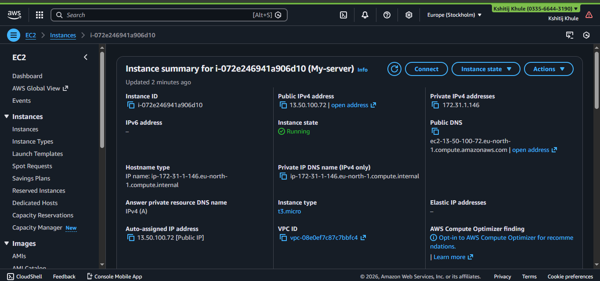
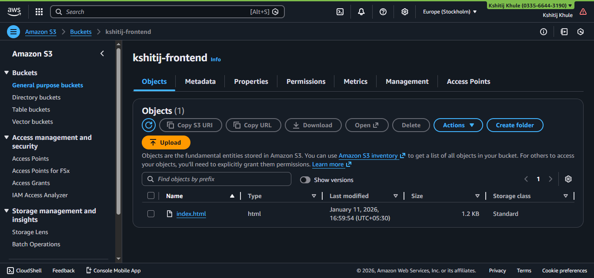
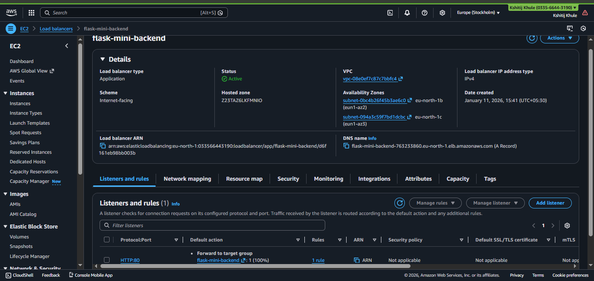
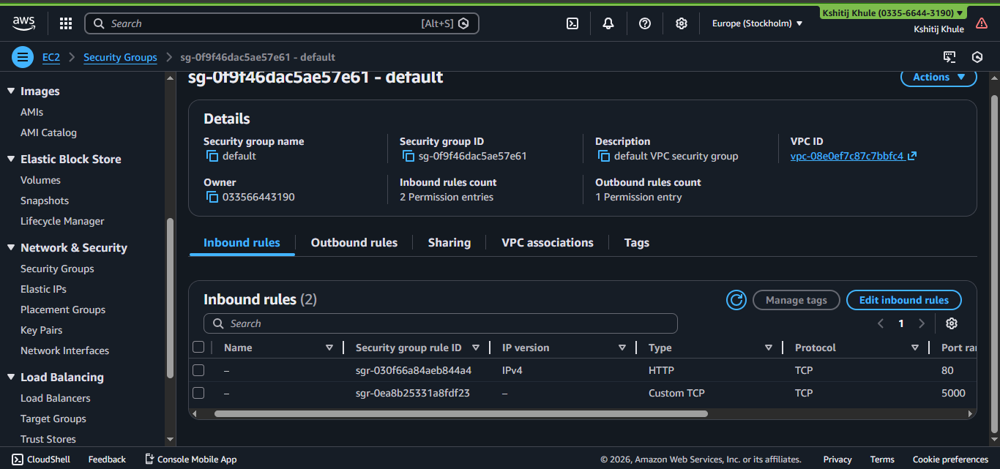

# 🎓 Student Management System - AWS Cloud Deployment

> **My First Cloud Project**: A hands-on learning journey deploying a full-stack application on AWS, understanding production architecture, CORS, security groups, and real-world debugging.

[](https://aws.amazon.com/)
[](https://flask.palletsprojects.com/)
[]()

---

## 📋 Table of Contents

- [About This Project](#about-this-project)
- [What I Learned](#what-i-learned)
- [Architecture](#architecture)
- [Tech Stack](#tech-stack)
- [AWS Services Used](#aws-services-used)
- [Features](#features)
- [Setup & Deployment](#setup--deployment)
- [Challenges & Solutions](#challenges--solutions)
- [Screenshots](#screenshots)
- [Cost Analysis](#cost-analysis)
- [Next Steps](#next-steps)
- [Resources](#resources)

---

## 🎯 About This Project

This is my **first cloud deployment project**, built to understand how production systems work. While the application code is simple (AI-assisted), the real learning came from:

- Setting up AWS infrastructure from scratch
- Understanding how frontend and backend communicate across different servers
- Configuring security groups and network access
- Debugging real-world issues (CORS, 404 errors, security groups)
- Learning Linux server management via SSH

**Project Type**: Foundation/Learning Project  
**Timeline**: January 2026 (1 week)  
**Primary Goal**: Understand cloud deployment, not application development  

---

## 🧠 What I Learned

### Cloud & Infrastructure
- ✅ How to launch and configure EC2 instances
- ✅ S3 static website hosting and bucket policies
- ✅ Application Load Balancer setup and target groups
- ✅ Security groups and their relationships
- ✅ VPC basics (public/private subnets)

### DevOps Practices
- ✅ SSH into remote servers using MobaXterm
- ✅ Linux commands for server management
- ✅ Running applications on EC2
- ✅ Git version control basics
- ✅ Python virtual environments (venv)

### Networking & APIs
- ✅ **CORS**: Why cross-origin requests need explicit permission
- ✅ **Absolute vs Relative URLs**: The `http://` makes all the difference!
- ✅ **Security Groups**: AWS's virtual firewall configuration
- ✅ **Load Balancer Health Checks**: How AWS monitors application health
- ✅ **HTTP Methods**: GET and POST in practice

### Debugging Skills
- ✅ Reading browser console errors
- ✅ Checking AWS target group health
- ✅ Using curl to test endpoints
- ✅ Systematic troubleshooting approach

For detailed learning notes, see [LEARNING.md](LEARNING.md)

---

## 🏗️ Architecture

### High-Level Overview
```
┌─────────────────────────────────────────────────────────────┐
│                         Internet                             │
└────────────────────┬────────────────────────────────────────┘
                     │
         ┌───────────┴──────────────┐
         │                          │
    [Port 443]                 [Port 80]
         │                          │
    ┌────▼─────┐              ┌─────▼──────┐
    │  AWS S3  │              │  AWS ALB   │
    │ (Static  │              │  (Load     │
    │ Website) │              │  Balancer) │
    └──────────┘              └─────┬──────┘
                                    │
                               [Port 5000]
                                    │
                             ┌──────▼────────┐
                             │   AWS EC2     │
                             │  Flask API    │
                             │  Amazon       │
                             │  Linux 2      │
                             └───────────────┘
```

### Request Flow

**Loading the Page:**
```
User Browser → S3 Bucket → index.html loads → JavaScript executes
```

**Adding a Student:**
```
User fills form → JavaScript fetch() → 
ALB (http://alb-dns.com:80) → EC2 (port 5000) → 
Flask processes → Returns JSON → 
JavaScript updates DOM → User sees new student
```

### Network Security

**Security Group Configuration:**
```
ALB Security Group:
  Inbound: Port 80 from 0.0.0.0/0 (Internet)
  Outbound: All traffic

EC2 Security Group:
  Inbound: Port 22 from MY_IP (SSH)
           Port 5000 from ALB_SG (Application traffic)
  Outbound: All traffic
```

---

## 🛠️ Tech Stack

### Frontend
- **HTML5**: Structure
- **Vanilla JavaScript**: Fetch API for HTTP requests
- **CSS**: Basic styling
- **Hosting**: AWS S3 Static Website

### Backend
- **Python 3.9**: Programming language
- **Flask**: Lightweight web framework
- **Flask-CORS**: Handle cross-origin requests
- **Hosting**: AWS EC2 (Amazon Linux 2)

### Cloud Infrastructure
- **AWS EC2**: t2.micro instance for backend
- **AWS S3**: Static website hosting for frontend
- **AWS ALB**: Application Load Balancer for traffic routing
- **AWS VPC**: Virtual Private Cloud for networking
- **AWS Security Groups**: Firewall configuration

---

## ☁️ AWS Services Used

| Service | Purpose | Configuration |
|---------|---------|---------------|
| **EC2** | Run Flask backend | t2.micro, Amazon Linux 2, SSH access |
| **S3** | Host static frontend | Static website hosting, public read access |
| **ALB** | Load balancing & single endpoint | Internet-facing, HTTP listener on port 80 |
| **Security Groups** | Network security | EC2: SSH + 5000, ALB: HTTP 80 |
| **VPC** | Network isolation | Default VPC, public subnet |
| **IAM** | Access management | EC2 instance profile (basic) |

---

## ✨ Features

- ➕ Add new students with name and marks
- 📋 View all students in real-time
- 🔄 Automatic refresh after adding students
- 🌐 RESTful API design
- 🔐 CORS-enabled for cross-origin requests
- ⚖️ Load balancer for scalability preparation

---

## 🚀 Setup & Deployment

### Prerequisites
- AWS Account with free tier
- Basic knowledge of terminal/command line
- SSH client (MobaXterm, PuTTY, or built-in terminal)
- Git installed locally

### Quick Start

**1. Clone Repository**
```bash
git clone https://github.com/kshitij-khule/flask-student-app.git
cd flask-student-app
```

**2. Deploy Backend to EC2**
```bash
# SSH into your EC2 instance
ssh -i your-key.pem ec2-user@your-ec2-ip

# Update system
sudo yum update -y

# Install dependencies
sudo yum install python3 python3-pip git -y

# Clone and setup
git clone https://github.com/kshitij-khule/flask-student-app.git
cd flask-student-app/backend

# Create virtual environment
python3 -m venv venv
source venv/bin/activate

# Install packages
pip install -r requirements.txt

# Run application
python3 app.py
```

**3. Deploy Frontend to S3**
- Create S3 bucket
- Enable static website hosting
- Update bucket policy for public access
- Upload `index.html`
- Update ALB DNS in JavaScript

For detailed step-by-step guide, see [SETUP.md](SETUP.md)

---

## 🐛 Challenges & Solutions

### Challenge 1: Missing `//` in URL
**Problem**: JavaScript fetch was failing with `SyntaxError: Unexpected token '<'`

**Root Cause**: 
```javascript
// ❌ Wrong - Missing //
fetch("http:alb-dns.com/students")

// ✅ Correct
fetch("http://alb-dns.com/students")
```

**What I Learned**: 
- Without `http://`, browser treats it as relative URL
- Tries to access: `s3-bucket-url/alb-dns.com/students`
- Gets 404 HTML page instead of JSON, causing parse error

**Solution**: Always use complete URL with protocol for cross-origin requests

---

### Challenge 2: CORS Errors
**Problem**: Browser blocked requests with CORS policy error

**Root Cause**: Frontend (S3) and backend (EC2) are different origins

**What I Learned**:
- Same-origin policy is browser security feature
- Different domains = different origins
- Backend must explicitly allow frontend's origin

**Solution**: Install and configure Flask-CORS
```python
from flask_cors import CORS
CORS(app)
```

---

### Challenge 3: 404 Not Found on `/students`
**Problem**: ALB returning 404 for backend endpoints

**Root Cause**: EC2 security group wasn't allowing traffic from ALB

**Debugging Process**:
1. ✅ Checked Flask was running: `curl localhost:5000/students` worked
2. ✅ Checked ALB health: Target was "unhealthy"
3. ❌ Realized security group didn't allow ALB → EC2 traffic
4. ✅ Added inbound rule: Allow port 5000 from ALB security group

**What I Learned**: 
- Always check security group relationships
- ALB needs permission to talk to EC2
- Health checks fail if security groups block traffic

---

### Challenge 4: Target Showing Unhealthy
**Problem**: ALB target group showing EC2 as unhealthy

**Possible Causes Checked**:
1. ❌ Flask not running → It was running ✓
2. ❌ Wrong health check path → Path was correct ✓
3. ✅ Security group blocking → THIS WAS IT!

**Solution**: 
- Updated EC2 security group
- Added inbound rule for port 5000 from ALB security group
- Target became healthy within 30 seconds

**What I Learned**: Security groups are bidirectional relationships

---

For more troubleshooting tips, see [TROUBLESHOOTING.md](TROUBLESHOOTING.md)

---

## 📸 Screenshots

### Application Interface

*The deployed student management system*

### AWS Architecture

*Complete system architecture*

### EC2 Dashboard

*Running EC2 instance hosting the Flask backend*

### S3 Configuration

*S3 bucket configured for static website hosting*

### Application Load Balancer

*ALB with healthy target*

### Security Groups

*Security group configuration*

---

## 💰 Cost Analysis

### Resources Used (1 Week)
| Service | Configuration | Estimated Cost |
|---------|--------------|----------------|
| EC2 t2.micro | 1 instance, 24/7 | $0.00 (Free tier) |
| S3 Standard | <1GB storage, <100 requests | $0.02 |
| Application Load Balancer | 1 ALB, minimal traffic | ~$16.00/month ⚠️ |
| Data Transfer | <1GB | $0.01 |
| **Total (1 week)** | | **~$4.50** |

**💡 Cost Optimization Learning:**
- ALB is expensive for learning projects ($16/month)
- Could use CloudFront + API Gateway instead
- Or direct EC2 public IP for learning (no ALB)
- Free tier covers EC2 and S3

**Note**: I deleted all resources after documenting to avoid charges.

For detailed cost breakdown, see [docs/cost-breakdown.md](docs/cost-breakdown.md)

---

## 🔒 Security Considerations

⚠️ **This is a learning project with known limitations:**

- ❌ No HTTPS (HTTP only)
- ❌ No authentication/authorization
- ❌ No input validation
- ❌ In-memory storage (data lost on restart)
- ❌ CORS allows all origins (`*`)
- ❌ No rate limiting
- ❌ EC2 SSH key stored locally (risk if compromised)

**For Production, Add:**
- ✅ HTTPS with SSL/TLS (AWS Certificate Manager)
- ✅ Authentication (JWT tokens, OAuth)
- ✅ Database (RDS, DynamoDB)
- ✅ Input sanitization
- ✅ Restrict CORS to specific origin
- ✅ Rate limiting and DDoS protection
- ✅ Secrets Manager for credentials
- ✅ CloudWatch monitoring and alerts

---

## 📈 Next Steps

### Immediate Improvements
- [ ] Add HTTPS with custom domain and ACM certificate
- [ ] Implement proper database (RDS PostgreSQL)
- [ ] Add update and delete operations
- [ ] Input validation and error handling
- [ ] Better frontend styling

### Learning Path Forward
- [ ] Learn Terraform for Infrastructure as Code
- [ ] Build CI/CD pipeline with GitHub Actions
- [ ] Implement monitoring with CloudWatch
- [ ] Add Docker containerization
- [ ] Deploy with ECS/EKS
- [ ] Multi-region deployment

### Next Project
Building a **production-grade CI/CD pipeline** with:
- Terraform (IaC)
- Docker
- GitHub Actions
- ECS/Fargate
- CloudWatch monitoring
- Blue-green deployment

---

## 📚 Resources That Helped Me

### AWS Learning
- [AWS Zero to Hero by Abhishek Veeramalla](https://www.youtube.com/playlist?list=PLdpzxOOAlwvI0O4PeKVV1-yJoX2AqIWuf)
- [AWS Documentation](https://docs.aws.amazon.com/)
- [AWS Free Tier](https://aws.amazon.com/free/)

### Tools
- [MobaXterm](https://mobaxterm.mobatek.net/) - SSH client for Windows
- [Visual Studio Code](https://code.visualstudio.com/) - Code editor
- [Draw.io](https://app.diagrams.net/) - Architecture diagrams

### Concepts
- [Understanding CORS](https://developer.mozilla.org/en-US/docs/Web/HTTP/CORS)
- [Flask Documentation](https://flask.palletsprojects.com/)
- [AWS Security Groups](https://docs.aws.amazon.com/vpc/latest/userguide/VPC_SecurityGroups.html)

---

## 🤝 Connect With Me

**Kshitij Khule**
- GitHub: [@kshitij-khule](https://github.com/kshitij-khule)
- LinkedIn: [https://www.linkedin.com/in/kshitijkhule/]
- Email: kshitijg.khule@gmail.com

---

## 📝 License

This project is open source and available under the [MIT License](LICENSE).

---

## 🙏 Acknowledgments

- **Abhishek Veeramalla** for the excellent AWS tutorials
- **AWS Free Tier** for making cloud learning accessible
- **Stack Overflow community** for debugging help
- **Claude AI** for code assistance and guidance

---

## ⭐ Project Stats

- **Lines of Code**: ~150 (backend + frontend)
- **Time Invested**: ~20 hours (learning + building + debugging)
- **AWS Services**: 6 (EC2, S3, ALB, VPC, Security Groups, IAM)
- **Bugs Fixed**: 4 major issues
- **Coffee Consumed**: ☕☕☕ Countless cups

---

**📌 Note**: This is a learning project focused on cloud deployment concepts, not application development. The application code serves as a vehicle to understand AWS services, networking, and production deployment practices.

---

<div align="center">

**Built with ☁️ by a cloud enthusiast learning one deployment at a time**

If this project helped you understand AWS deployment, please give it a ⭐!

</div>


